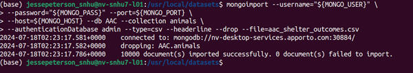

# Project Two - Animal Shelter

## Why Crud?
Adding CRUD (Create, Read, Update, Delete) commands to the Python script give use the ability to efficiently interact with the MongoDB database. These commands also help individuals with lesser computer knowledge to interact with the documents in the database.

### Python driver for MongoDB
The module uses a the **'pymongo'** driver for enableing the script to interact with the MongoDB database. **'pymongo'** is the official driver for Python from MongoDB

### CRUD Operations
The class in the python script **'AnimalShelter'**, offers methods for each of the CRUD operations. Such as the examples below

### Prerequisites
1. Python - Download the latest verison for your system
    - [Python](https://www.python.org/downloads/)
2. Jupyter Notebook - Download the latest version for your system
    - Jupyter Notebook is used for running the ipynb files
    - [Jupyter Notebook](https://jupyter.org/install)
3. PyMongo
    - PyMongo is the official MongoDB libraries for our Python code
    - [PyMongo](https://pypi.org/project/pymongo/)
 ```bash
        python -m pip install pymongo  
 ```
4. Your IDE of choice
    - If you want to manipulate the Python code and IDE is recommended.

### Installation
1. Download the latest version of the code from the repository
2. When in your environment, use the mongoimport command to import the data to the Database. (See #1 in demonstration section)

#### Initialization
Below the code imports the python script and sends the login credentials.
```python
    from aac_crud import AnimalShelter
    Shelter = AnimalShelter("Username","Password")
```

Users can create documents using the Python dictionary data type. The by calling the create() function they can pass the document to be added to the database
#### Create
```python
    document = {
        'animal_id': 'A1233456',
        'breed': 'Alaskab husky'
    }

    shelter.create(document)
```

By providing a simple or complex query search, the system will search for the document the same as the Mongo Shell. The script will return a list which you can itterate through to find all occurances of your query search
#### Read
```python
    query = {'animal_id': 'A123456'}
    results = shelter.read(query)

    for doc in results:
        print(doc)
        print("")
```

Below there is a new dictionary with values to change. when passed through the update() function it will seek all documents that fit that criteria.
#### Update
```python
    new_document = {
        'breed': 'Alaskan_Husky',
        'color': 'blue'
    }

    results = shelter.update(query, new_document)
    print(f'Updated {results} document(s)')
```

To delete documents from the database the only thing that must be passed is the query. That is unless you want to delete all ocurrances, then you would have a second parameter boolean where when true it deletes all ocurrances.
#### Delete
```python
    query = {'animal_id', 'A123456'}
    
    results = shelter.delete(query)
    print(f'Deleted {results} document(s)')
```


## Demonstration
1. Data Import
    
2. Authentication
    .png)
3. CRUD testing
    .png)