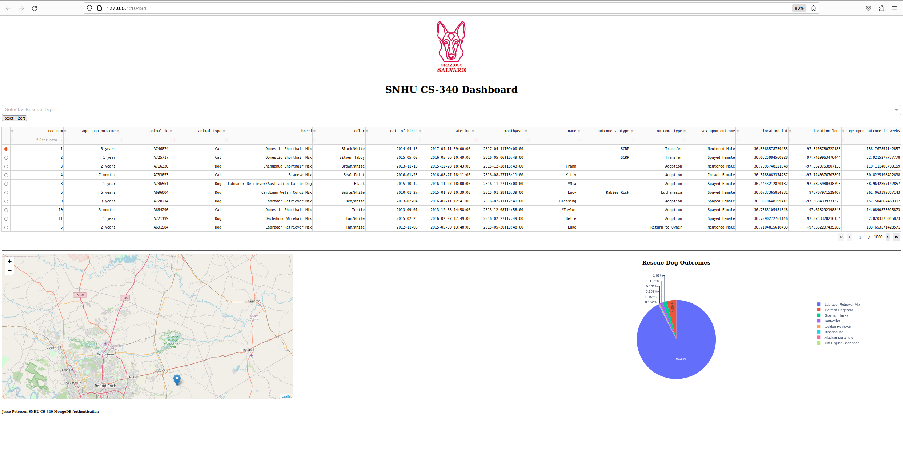
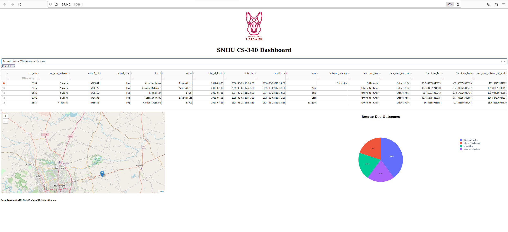
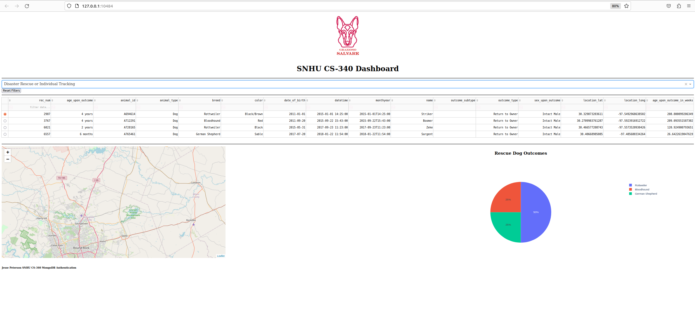
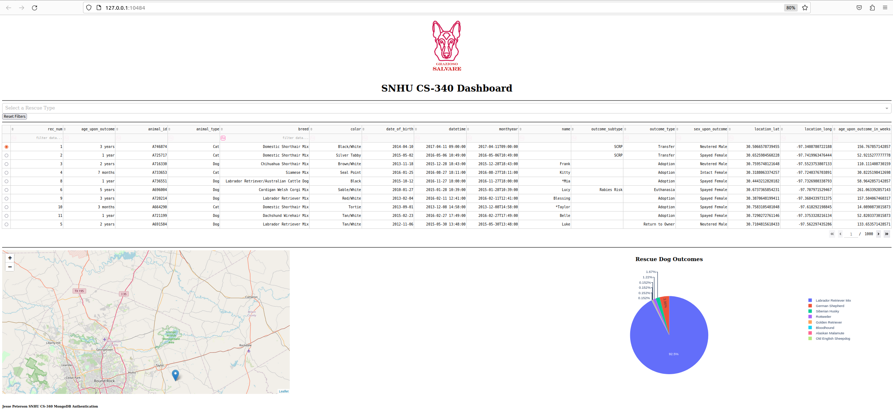

# Project Two - Animal Shelter

## Required Functionality
This project consists of creating a web-based dashboard using MongoDB as the database and the Dash framework. The purpose for the dashboard is to display data on dogs that are currently in shelters who fit credentials of becoming rescue animals. The app features a dropdown, table, map, and chart. The dropdown allows users to select filters depending on the type of rescue dogs are being searched for. The table displays all information on the animals. The map is used to help the user locate the shelter that is holding the animals. Finally, the chart helps users to see how many dog breeds are available for each rescue type and their percentage.

### 1. The initial dashboard screen

### 2. Water Rescue

### 3. Mountain or Wilderness Rescue

### 4. Disaster or Individual Tracking

### 5. Reset (Returned to Unfiltered State)


## Tools and Rationale
### MongoDB:
MongoDB is used as the database management system because of its flexibility with storing and querying documents. This database is ideal for managing the complex datasets such as these documents that handle animals in an animal shelter. MongoDB has an official library for Python called PyMongo which allows for seamless integration with the Dash Framework and data manipulation using CRUD commands.

### Dash Framework:
Dash was the chosen framework for this program due to the capabilities in with creating interactive web applications using Python. The declarative nature of Dash allows for straightforward linking between UI element using Python callbacks. 

### Additional Tools

1. Python - Download the latest verison for your system
    - [Python](https://www.python.org/downloads/)
2. Jupyter Notebook - Download the latest version for your system
    - Jupyter Notebook is used for running the ipynb files
    - [Jupyter Notebook](https://jupyter.org/install)
3. PyMongo
    - PyMongo is the official MongoDB libraries for our Python code
    - [PyMongo](https://pypi.org/project/pymongo/)
 ```bash
        python -m pip install pymongo  
 ```
4. Your IDE of choice
    - If you want to manipulate the Python code an IDE is recommended.

## Steps Taken to Complete the Project
1. Setting up the Environment
    - Installed the necessary libraries(`Dash`, `PyMongo`)
    - Set up the MongoDB database and populate it with the animal shelter data
    - Example Import of CSV: 

    
2. Designing the Layout
    - Creating the dashboard using Dash components like `html.Div`, `dcc.Dropdown`, and `dcc.Graph`
3. Implementing Functionality
    - Linked the dropdowns and reset button to the MongoDB queries through Dash callbacks
    - Developed functions to fetch and filter data based on user selection
    - Added error handling and default selections to account for edge cases
4. Testing
    - Tested each component of the UI, ensuring that it behaves as expected and no errors are thrown.
    - Tested the UI components to ensure that it will work for the users

## Challenges and Solutions
1. Filtering Data

    I had issues with filtering the data. I was successful with filtering the data in the `update_table` callback function. I used
    ```python
        df['breed'].str.contains('Labrador Retriever Mix|Chesapeake Bay Retriever|Newfoundland') # Water Rescue
    ```
    I realized that I would need this same data except for all categories for the `update_chart` callback. I opted to used a list that contained all of the dog breeds.
    ```python
        preferred_breeds = [
            'Labrador Retriever Mix', 'Chesapeake Bay Retriever', 'Newfoundland', # Water Rescue
            'German Shepherd', 'Alaskan Malamute', 'Old English Sheepdog', 'Siberian Husky','Rottweiler', # Mountain or Wilderness Rescue
            'Doberman Pinscher', 'German Shepherd', 'Golden Retriever', 'Bloodhound', 'Rottweiler' # Disaster Rescue or Individual Tracking
        ]
    ```
    This allowed the chart to display all rescue breeds by default and removed redundancy from the `update_table` and `update_chart` callback functions.

2. Displaying the logo image

    I had issues when trying to render the Grazioso Salvare Logo, I implemented the image into the header using the following code:
    ```python
        html.Center([
            html.A(
                href="https://www.snhu.edu",
                children=html.Img(
                    src='./GraziosoSalvareLogo.png',
                    style={'height': '200px'}
                ),
                target='_blank',
            ),
        ]),
    ```
    When I went to launch the dashboard I would an error sign with a broken image. After some research I found that Dash likes when images are in a folder names assets in the root directory of the project. This was quickly fixed by creating the `assets` folder and moving the image in there's. I also had to change the src for the image to:

    ```python
        src='/assets/GraziosoSalvareLogo.png'
    ```